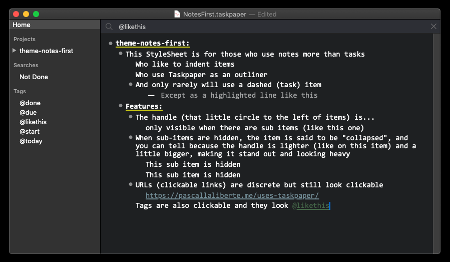

# A Notes First theme for Taskpaper 3

This theme for [Taskpaper 3](http://www.taskpaper.com) is great if you:

* Use *notes* items a lot, and tasks (dashed items) just a little
* Find the handle (the circle next to the lines) handy mostly to collapse indented items
* Prefer URLs to appear discreetly, but still look clickable
* Prefer to use the keyboard to cut-paste items to re-order them over using draggable handles to re-order items (on the Mac anyway)

## Here's how to install the theme (all new instructions for v3.5 and up)

1. Download the zip and open the zip folder
2. `Window` menu > `StyleSheet` > `Open StyleSheet Folder` *<-- from within Taskpaper*
3. Drag `Notes First.less` from the zip folder to the `StyleSheet` Folder
4. `Window` menu > `StyleSheet` > `Notes First.less` *<-- also from within Taskpaper*

## Get notified of updates

Updates don't come up very often, but to be sure you're ready when new versions of Taskpaper are announced, [subscribe to be notified by email](http://pascallaliberte.me/uses-taskpaper/). I'll also share on how I use Taskpaper (centered on objectives).

## 💙 Taskpaper

Thanks [Jesse Grosjean](http://www.hogbaysoftware.com/about) for Taskpaper 3.
